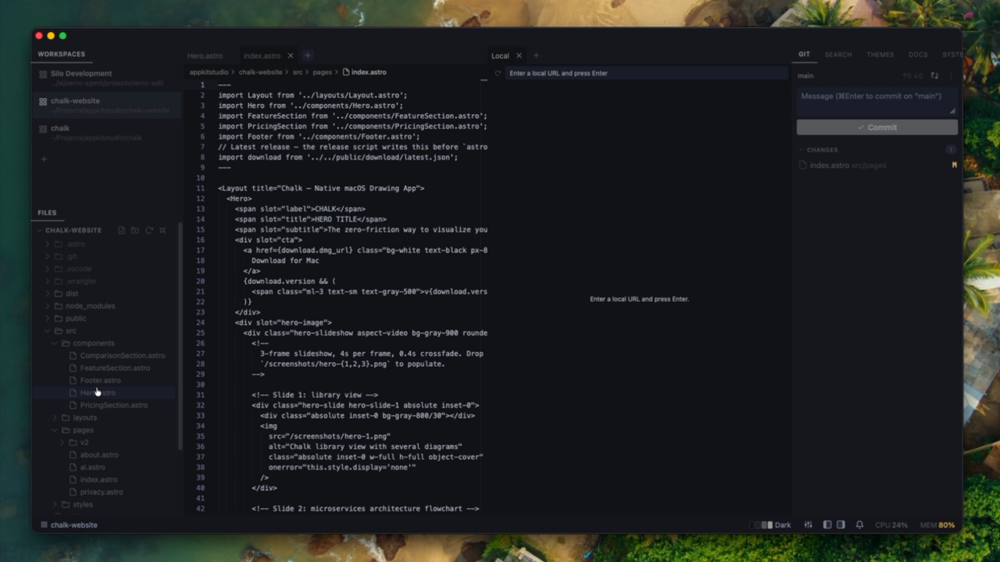

<h3>All your projects, alive at once —<br>for developers juggling coding agents</h3>

Keep every project you're juggling running simultaneously — terminals, agents, and layout intact — switch between them instantly. 100% open source, free forever.

[**Download for macOS →**](https://github.com/silo-code/silo/releases/latest) &nbsp;·&nbsp; [**Download for Linux →**](https://github.com/silo-code/silo/releases/latest) &nbsp;·&nbsp; [Docs](https://getsilo.dev) &nbsp;·&nbsp; [Extensions](https://extensions.getsilo.dev) &nbsp;·&nbsp; [Roadmap](https://getsilo.dev/roadmap) &nbsp;·&nbsp; [Follow on X](https://x.com/silo_code)

   -yellow>) 

---

[](https://getsilo.dev/demo.mp4)

---

## The problem with one-workspace-at-a-time editors

VS Code and Cursor are file-first editors. They're built around a single active workspace — which made sense when _you_ were writing the code.

Now you're coordinating 3–5 AI coding agents simultaneously across different projects. Every time you switch context, you lose your terminal state. Your agents get interrupted. You spend more time rebuilding context than doing actual work.

**Silo is built around the opposite model.**

Open as many project workspaces as you need and tab between them instantly. Each workspace keeps its terminals running, its layout intact, and its agents working — exactly as you left it. Switching takes a keystroke, not a minute.

## How it works

- **Instant switching, zero reload** — each project gets its own persistent tab; switch instantly without losing anything
- **Free and open source, forever** — MIT licensed, no subscription, no account, no enterprise tier; fork it, contribute to it, build on it
- **Local-first** — everything runs on your machine; no cloud sync, no telemetry, no account required
- **Layout that sticks** — each workspace remembers its exact terminal tab arrangement; name tabs for specific jobs and they're waiting exactly where you left them
- **Terminals and editors as equals** — a terminal tab and an editor tab are the same thing; arrange them side by side, stack them, name them; span a workspace across multiple folders for monorepos or paired projects
- **Extension SDK** — every built-in feature ships as an extension against the same public API you get; browse and install from [extensions.getsilo.dev](https://extensions.getsilo.dev) or **Settings → Extensions**

## Extend Silo with Claude Code

Silo ships a Claude Code skill that turns a plain-English description into a working extension — scaffolded from scratch, written in TypeScript, compiled, and hot-installed into the running app. No SDK knowledge required. Just describe what you want.

**Step 1 — install the skill once:**

```bash
mkdir -p ~/.claude/skills/silo-extension-builder && \
  curl -fsSL -o ~/.claude/skills/silo-extension-builder/SKILL.md \
  https://raw.githubusercontent.com/silo-code/silo/main/skills/silo-extension-builder/SKILL.md
```

**Step 2 — describe what you want:**

```
/silo-extension-builder Create a status bar item that shows the current git branch
and a dot when there are uncommitted changes.
```

Claude scaffolds the project, writes the TypeScript, compiles it, and installs it — all without leaving your terminal. The result is a real extension you own: edit the source, rebuild with `npm run build`, reinstall with `silo install`.

**Things people have built this way in a single session:**

- **Git branch status bar** — branch name + dirty indicator, updates on workspace switch
- **GitHub Issues panel** — lists open issues for the active repo via `gh`, with a refresh button
- **Scratch pad** — persisted notes panel that survives restarts
- **Todo manager** — reads and writes `TODO.md` in the active workspace, with checkboxes and inline add

Extensions install and uninstall live — no restart needed:

```bash
silo install silo.local-web-viewer              # from the registry by id
silo install ~/my-extensions/dave.git-branch    # or from a local folder
silo uninstall dave.git-branch
```

→ [Extension catalog](https://extensions.getsilo.dev) · [Full guide](https://getsilo.dev/guide/claude-skill) · [Extension API](https://getsilo.dev/api/)

## Who it's for

- You run Claude Code, Aider, or other AI coding agents and want to keep several going at once
- You work across multiple projects simultaneously and hate losing terminal state when switching
- You live in the terminal more than the editor
- You've hit the ceiling of what a single-workspace editor can do for your workflow

## vs. VS Code / Cursor

|                          | VS Code / Cursor                     | Silo                                      |
| ------------------------ | ------------------------------------ | ----------------------------------------- |
| **Switching projects**   | Reopens folder, loses terminal state | Instant tab switch — everything preserved |
| **Multiple agents**      | One active workspace at a time       | Many workspaces, all live simultaneously  |
| **Primary surface**      | File editor                          | Terminal + agents                         |
| **Background terminals** | Die or disconnect                    | Stay running                              |
| **Extensible**           | Yes                                  | Yes — open SDK, MIT licensed              |
| **Cost to try**          | Free (VS Code) / paid (Cursor)       | 100% open source, free forever            |

## vs. AI orchestrators (Superset, Conductor, etc.)

|                     | Orchestrators                          | Silo                                  |
| ------------------- | -------------------------------------- | ------------------------------------- |
| **Primary unit**    | Agent tasks (worktrees)                | Workspaces — your whole project       |
| **Scope**           | Agent work only                        | _All_ your work — agent-driven or not |
| **Switch cost**     | Re-open editor per task                | Zero — nothing reloads                |
| **Close a project** | Lose non-agent context                 | Resurrects intact, weeks later        |
| **License**         | Source-available or closed (typically) | 100% open source (MIT), free forever  |

## Download

**macOS** (v0.4.0):

| Build                    | Link                                                               |
| ------------------------ | ------------------------------------------------------------------ |
| Apple Silicon (M1/M2/M3) | [Download .dmg](https://github.com/silo-code/silo/releases/latest) |
| Intel Mac                | [Download .dmg](https://github.com/silo-code/silo/releases/latest) |

**Linux** (v0.4.0):

| Build         | Link                                                                    |
| ------------- | ----------------------------------------------------------------------- |
| AppImage      | [Download .AppImage](https://github.com/silo-code/silo/releases/latest) |
| Debian/Ubuntu | [Download .deb](https://github.com/silo-code/silo/releases/latest)      |

**Windows** — experimental builds are attached to every [GitHub Release](https://github.com/silo-code/silo/releases) and may not work correctly. If you try it, please [open an issue](https://github.com/silo-code/silo/issues) with what you find.

**Nightly builds** — built every night from `main`; may be unstable. [Get the latest nightly →](https://github.com/silo-code/silo/releases/tag/nightly)

---

## Develop

Silo is a [pnpm](https://pnpm.io/) workspace (monorepo). Run commands from the repo root.

```bash
pnpm install
pnpm dev             # runs the "Silo Dev" build (isolated identity + data)
```

`pnpm dev` launches a separate **Silo Dev** app with its own icon and storage,
so it runs side-by-side with an installed stable Silo without clobbering its
state.

| Task                              | Command                                |
| --------------------------------- | -------------------------------------- |
| Dev app (isolated identity)       | `pnpm dev`                             |
| Build a release bundle            | `pnpm --filter silo app:build`         |
| Typecheck                         | `pnpm --filter silo exec tsc --noEmit` |
| Lint (architecture boundary gate) | `pnpm lint`                            |
| Test                              | `pnpm test`                            |
| Docs site (live)                  | `pnpm docs:dev`                        |

### Repo layout

```
apps/desktop             # the Tauri desktop app (+ src-tauri Rust crate)
packages/sdk             # @silo-code/sdk — the public, types-first extension SDK
packages/extension-host  # the workbench host runtime (+ /internal surface)
packages/extensions-core / extensions-silo  # bundled first-party extensions
packages/ui              # internal shared components (private)
examples/extensions      # example extensions that dogfood the SDK
apps/docs                # @silo-code/docs — docs + API reference site (VitePress)
```

## Releases

Releases are driven by [Conventional Commits](https://www.conventionalcommits.org/).
On every push to `main`, [release-please](.github/workflows/release-please.yml)
maintains a "release vX.Y.Z" PR that bumps the version everywhere and updates
`CHANGELOG.md`. Merging that PR tags `silo-vX.Y.Z`, which triggers the
[release workflow](.github/workflows/release.yml) to build macOS installers and
publish them to GitHub Releases. The installed app checks for updates on launch
and via **Silo → Check for Updates…**.

## Architecture

- Extensions touch the app **only** through `ctx` and `@silo-code/sdk` types. The boundary is enforced by the package graph and lint (platform ban + design-token CSS rule). See [`CLAUDE.md`](CLAUDE.md) and [`docs/`](docs/).
- The API reference is generated from source: `pnpm docs:api` → [getsilo.dev](https://getsilo.dev/)

## License

[MIT](LICENSE) © Dave Weaver
