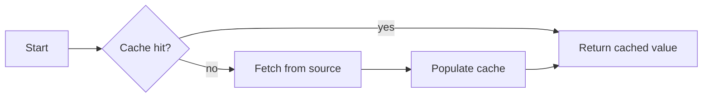
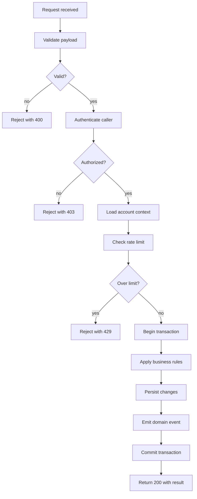
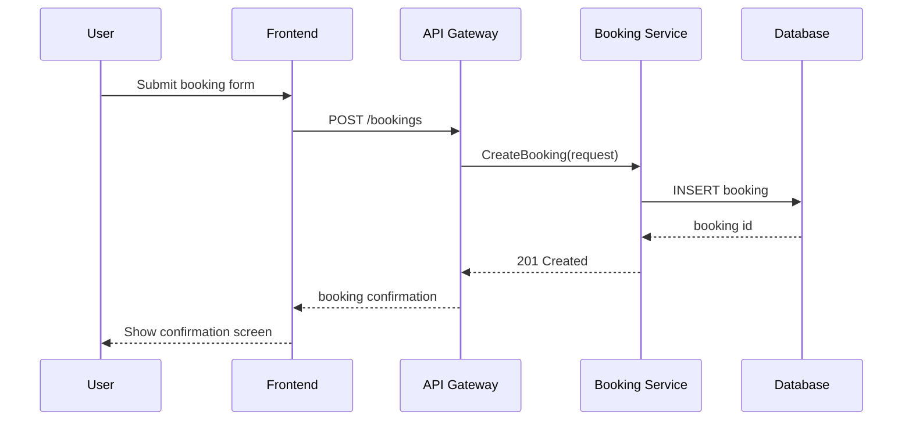
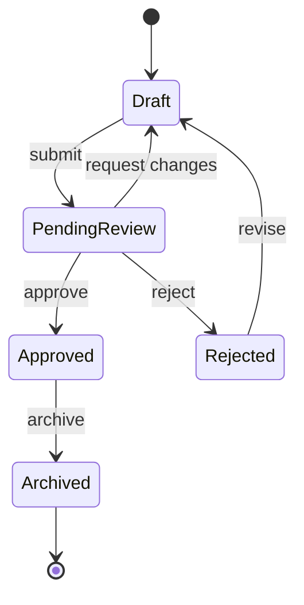
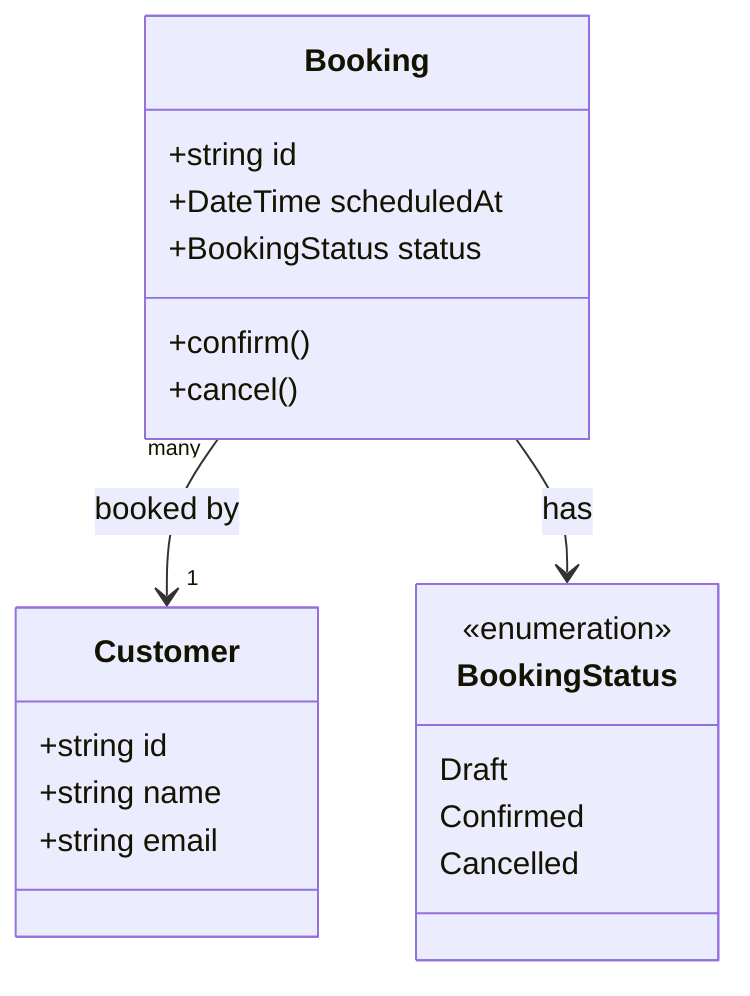
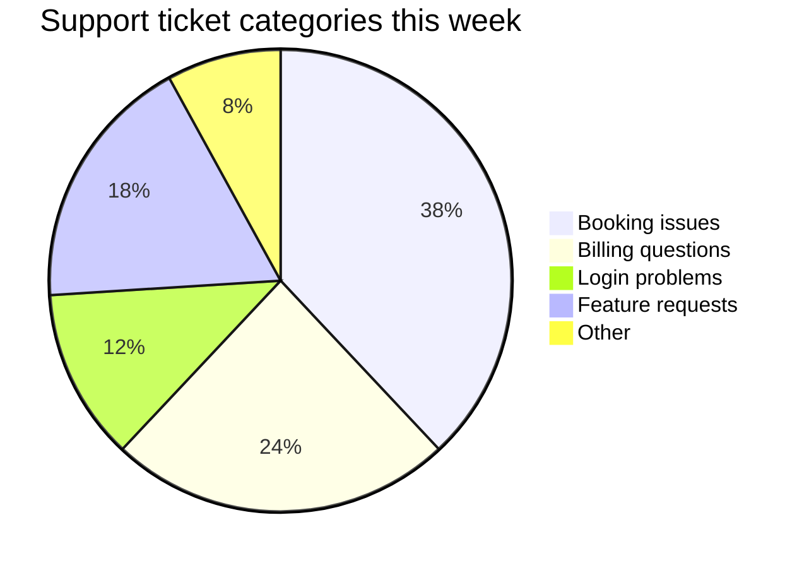

# Mermaid diagram gallery

A sampler of [Mermaid](https://mermaid.js.org) diagram types and sizes, for
exercising Markdown Preview's diagram rendering (scale-to-fit, the expand-to-modal
button, and theme colors). Open this file and switch to **Preview** to view it.

## A small flowchart

Compact enough to render at (or near) native size inline.



## A wide flowchart

Long node and edge labels push this well past a narrow pane's width — a good
check that it scales down cleanly instead of overflowing, and that the expand
button gives back the detail at full size.

```mermaid
flowchart LR
    A["Client submits booking form\n(ScheduleDraftValues, FE state)"]
    B["Confirmation modal collects final details\n(IModalConfirmResponse)"]
    C["Frontend maps draft + confirmation\ninto SubmitJobBookingInput"]
    D["No mapper exists yet for this path\n(tracked as follow-up work)"]
    E["Existing mapper converts to the wire format\n(JobBookingMapper.ToBookJobRequest, ~1:1 copy)"]
    F["Monolith receives BookJobRequest\nand creates the job"]

    A -->|"phase 4: initial submit"| B
    B -->|"phase 6: confirm-mapping\n(exists, being corrected)"| C
    C -.->|"NO MAPPER EXISTS YET\nfor any path"| D
    D -->|"planned"| E
    E -->|"exists, ~1:1 copy"| F
```



## A tall flowchart

Many nodes stacked top-down — a check on vertical scaling and the expand
modal's scroll behavior for diagrams taller than the viewport.



## A sequence diagram

A different diagram shape entirely — vertical lifelines and horizontal
messages, rather than a node graph.



## A state diagram



## A class diagram



## A pie chart

A non-graph shape — good check that scale-to-fit and theme colors hold up
outside the node/edge diagram family too.



## A small diagram with an intentional syntax error

Checks the error fallback — this should show a readable error plus the raw
source, not a blank pane.

```mermaid
flowchart LR
    A[Start --> B[Missing closing bracket above]
```

Plain text after the gallery, to confirm normal Markdown keeps rendering
normally around and after the diagrams.
